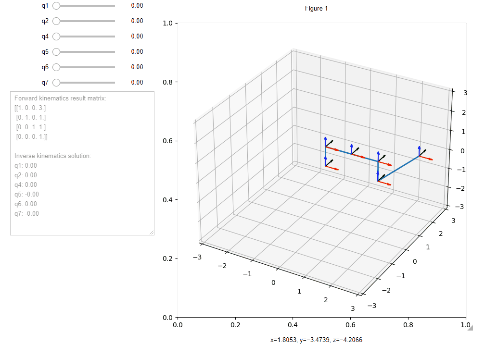

# Assignment 1
[](https://colab.research.google.com/github/4ku/Inno-robotics-labs/blob/master/Dynamics%20of%20non%20linear%20robotic%20systems/Assignment%201/SCARA_YZX_robot.ipynb)

## How to run

At first you need Jupyter Notebook to be installed.  
Then run:
```
pip install -r requirements.txt
jupyter contrib nbextension install --user
jupyter nbextension enable --py widgetsnbextension
jupyter labextension install jupyter-matplotlib
jupyter labextension install @jupyter-widgets/jupyterlab-manager
```  

This works well for Windows. For Linux systems there are some problems can appear.  

## Example  
  
