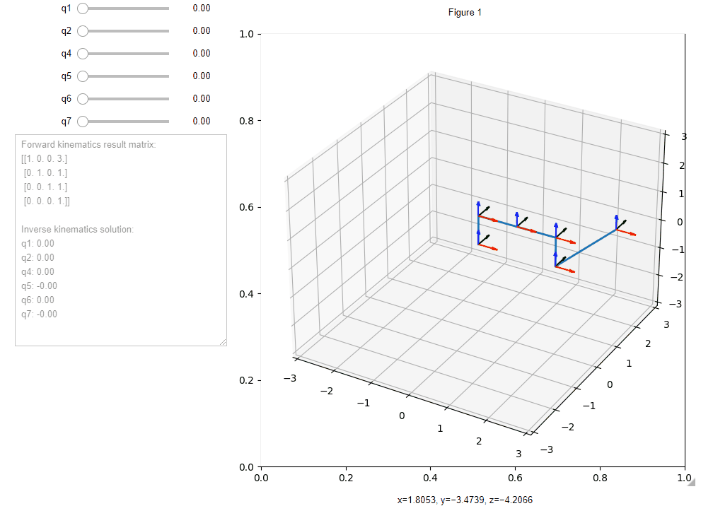

# How to run
At first you need Jupyter Notebook to be installed.  
Then run:
```
pip install -r requirements.txt
jupyter contrib nbextension install --user
jupyter nbextension enable --py widgetsnbextension
jupyter labextension install jupyter-matplotlib
jupyter labextension install @jupyter-widgets/jupyterlab-manager
```  

This works well for Windows. For Linux systems there are some problems can appear.  

# Example  
  
