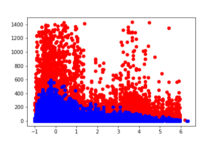

# Assignment 1  
We have dataset with information about flights and delay for each flight. Using this information we should estimate delay for new flight. 

Below we try to solve this problem using machine learning.

## Data description

### Explore data

*Flight delay - flight duration dependency*

#### Delay histogram

*Number of delays under 50 minutes*

*Number of delays over 50 minutes and under 300 minutes*

*Number of delays over 300 minutes*

## Outlier detection and removal
We can find outliers using `isolation forest` method. More about this method you can read [here](https://scikit-learn.org/stable/modules/generated/sklearn.ensemble.IsolationForest.html). 
The result of the method:

*X axis - normalized flight duration, Y axis - flight delay. **Red** color is outliers, **blue** - remaining data*

## Models results
| Model\Error                      | Train MSE | Train MAE | Test MSE | Test MAE |
|----------------------------------|-----------|-----------|----------|----------|
| Linear regression                | 353.3     | 9         | 1602     | 10.9     |
| Ridge regression                 | 353.3     | 9         | 1602     | 10.9     |
| Lasso regression                 | 316.69    | 8.74      |**1600.9**| 10.76    |
| Polynomial regression (2 degree) | 314.93    | 8.71      | 1606.51  | 10.74    |
| Polynomial regression (3 degree) | 314.2     | 8.69      | 1605.60  | **10.70**|
| Polynomial regression (4 degree) | **312.66**| **8.63**  | 1617.31  | 10.97    |

* We can see, that one of the best models on test data are `Lasso regression` and `Polynomial regression` of 3d degree. 
* The best model on train data is `Polynomial regression` of 4th degree. It has lots of features, so it overfit around train data. That's why train error is low. But for test data this model shows the worst results.
* Train error and test error differ too much, because we removed outliers. So outliers don't influence on train error.

### How to improve the results
* Use another models
* Get more features
